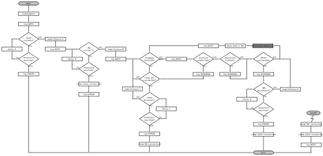

# RPi Cluster Head Software Setup #

In the following, information on the preparations, prerequisites and the setup of the Raspberry Pi-based cluster head software can be found.
Additionally, links to further information are given.

## Prerequisites ##

* Make sure you have Python 3 and the required packeges (i.e., `pip` and `libmysqlclient`) installed:  
    `sudo apt install python3-dev python3-pip default-libmysqlclient-dev`  
    (Note: the XBee Python library is currently only compatible with Python 3.)

* The following software components are required to run XBee Python applications:
    * [**PySerial 3**](https://pyserial.readthedocs.io/en/latest/pyserial.html):
        * For authentication of BLE devices.
        * This module is automatically downloaded when you install the XBee Python library.
        * Alternatively, it can be installed via `pip` with:  
            `python3 -m pip install pyserial`
    * **MySQL Connector**:
        * Python needs a MySQL driver to access the remote MySQL database.
        * In the provided scripts, the [`mysql-connector`](https://dev.mysql.com/doc/connector-python/en/connector-python-installation-binary.html) module is used:  
            `python3 -m pip install mysql-connector-python`
        * Alternatively, you can use [`mysqlclient`](https://pypi.org/project/mysqlclient/):  
            `python3 -m pip install mysqlclient`  
            or [`PyMySQL`](https://pypi.org/project/PyMySQL/):  
            `python3 -m pip install PyMySQL`
    * [**SRP** (Secure Remote Password protocol)](https://pypi.org/project/srp/):
        * This module is automatically downloaded when you install the XBee Python library.
        * Alternatively, it can be installed via `pip` with:  
            `python3 -m pip install srp`
    * [**XBee Python library software**](https://xbplib.readthedocs.io/en/latest/):
        * The library can be automatically downloaded and installed with:  
            `python3 -m pip install digi-xbee`
        * Alternatively, you can get the source code of the library from [Github](https://github.com/digidotcom/xbee-python).

However, if you use the Xbee for the first time and want to configure fresh modules, it is advisable to use Digi's [XCTU](https://www.digi.com/products/embedded-systems/digi-xbee/digi-xbee-tools/xctu) tool (available for Windows, Linux, Mac), see below.

## Program Execution

The cluster head software (i.e., Python script) is divided in four stages with different main objectives, each.
The general flow of program execution is as follows:  

## Remote Access ##

In our case, the cluster head software is running on a Raspberry Pi that is accessed remotely, that is, via SSH.
To have the Python script continue to run after ending the SSH session, we use the terminal multiplexer program [`tmux`](https://github.com/tmux/tmux/wiki).
It can be easily installed with:  
    `sudo apt install tmux`

To initially start the cluster head script, log into the RPi via SSH and start the terminal multiplexer with:  
    `tmux`  
Then navigate to the directory where the script is located and start it in the usual manner, e.g., with:  
    `python3 rpi_cluster_head.py`  
You can safely close the SSH session now, for example, by pressing `CTRL+b` and then type `d` for detach.

Whenever you want to return to the session, just log into the RPi again via SSH and attach to the previous `tmux` session with:  
    `tmux attach`  
That's it ;)

## Xbee3 Zigbee ##

The Xbee3 is a powerful radio offering a wide range of functions.
In addition to Zigbee, 802.15.4 and Digimesh support (selectable by writing the appropriate firmware), it also has a BLE interface (disabled by default).
Using the BLE interface, you can configure the module using a smartphone in combination with the _Digi XBee Mobile_ app.
However, if you use the XBee for the first time and/or want to configure fresh modules, it is advisable to use Digi's [XCTU](https://www.digi.com/products/embedded-systems/digi-xbee/digi-xbee-tools/xctu) tool on a PC (Windows, Linux, Mac).
For that purpose, you will need to use a XBee to serial adapter such as the [Wavexhare XBee USB Adapter](https://www.waveshare.com/wiki/XBee_USB_Adapter).
Alternatively, the configuration can also be done via the UART interface and AT commands.

### Configuration for ASN(x) ###

In the following, the basic configuration of the XBee 3 modules for the use with our ASN(x) sensor nodes is described.
Depending on your application, requirements, etc. you may need to adapt certain parameters.
The explanation of the particular parameters and example configurations can be found in the [XBee 3 User Manual](https://www.digi.com/resources/documentation/digidocs/pdfs/90001539.pdf).
If you use the [XCTU](https://www.digi.com/products/embedded-systems/digi-xbee/digi-xbee-tools/xctu) tool for the configuration, the parameters are grouped to categories; the same as we use below.
Parameters not mentioned in the list below are left at their initial/default value.

* **Networking**
    * `CE` (_device role_)  
        set to `1` (form network).
    * `ID` (_extended PAN ID_)  
        set to a defined address, e.g., `FEDCBA9876543210`.

* **Discovery Options**
    * `NI` (_node identifier_)  
        you can set a user-defined name; we use `CH` for our cluster head.

* **Sleep Settings**
    * `SM` (_sleep mode_)  
        leave the sleep mode at `0` (router/coordinator).

* **Bluetooth Options**
    * We use the BLE interface during development to have an easy access to the XBee's setting via the [Digi XBee mobile app](https://www.digi.com/products/embedded-systems/digi-xbee/digi-xbee-tools/digi-xbee-mobile-app).  
        However, in the actual deployment, the BLE interface is deactivated to save energy and for security reasons.
    * `BT` (_Bluetooth enable_)  
        activate the BLE interface by setting this parameter to `1` (you will be asked to set a BLE password).
    * `BI` (_Bluetooth identifier_)  
        optionally, a user-defined BLE identifier can be set to easily identify the single XBees in the mobile app.  
        We use `XBee CH` similar to the _NI_ described above.  
        The prefix `XBee` is used to filter the available Bluetooth devices in the mobile app (i.e., only show Bluetooth devices whose identifier starts with `XBee`).

* **API Configuration**
    * `AP` (_API enable_)  
        we use the XBee in API mode, therefore, set this parameter to `1` (API mode without escapes).

* **UART Interface**
    * We use a higher baud rate for faster communication with the UART interface (i.e., 115200 8N1).
    * `BD` (_UART baud rate_)  
        set to `7` (115200 b/s)
    * `NB` (_UART parity_)  
        set to `0` (no parity)
    * `SB` (_UART stop bits_)  
        set to `0` (one stop bit)

## Links ##

In the following links with further or complementary information are listed.

#### Xbee Python ####

- [Get started with XBee Python library](https://xbplib.readthedocs.io/en/latest/getting_started_with_xbee_python_library.html)
- [Introducing the Official Digi XBee Python Library](https://www.digi.com/blog/post/introducing-the-official-digi-xbee-python-library)
- [Digi XBee Python library](https://github.com/digidotcom/xbee-python)

#### Hardware ####

- [Xbee3](https://www.digi.com/products/browse/xbee3)
  * [XCTU - Next Generation Configuration Platform](https://www.digi.com/products/embedded-systems/digi-xbee/digi-xbee-tools/xctu)
  * XBee firmwares:
    * [Zigbee](https://www.digi.com/products/embedded-systems/digi-xbee/rf-modules/2-4-ghz-rf-modules/xbee3-zigbee-3)
    * [802.15.4](https://www.digi.com/products/embedded-systems/digi-xbee/rf-modules/2-4-ghz-rf-modules/xbee3-802-15-4)
    * [Digimesh](https://www.digi.com/products/embedded-systems/digi-xbee/rf-modules/2-4-ghz-rf-modules/xbee3-digimesh-2-4)
  * XBee libraries (Python):
    * [Digi XBee Python library](https://github.com/digidotcom/xbee-python)
  * Misc:
    * [Common XBee Mistakes](https://www.faludi.com/projects/common-xbee-mistakes/)
